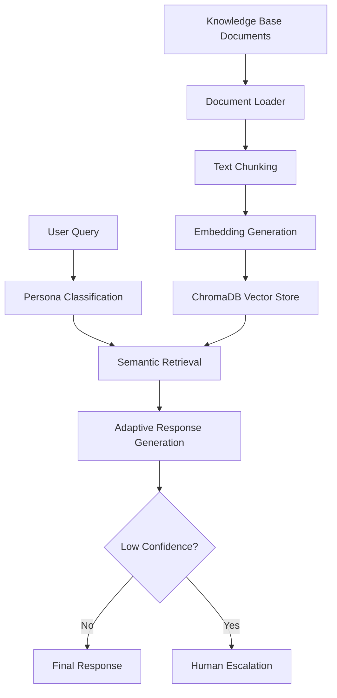
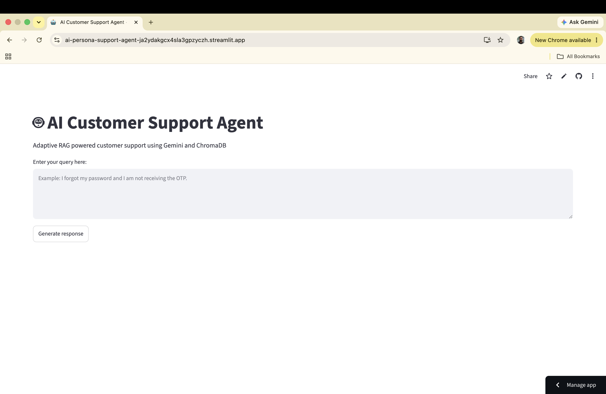
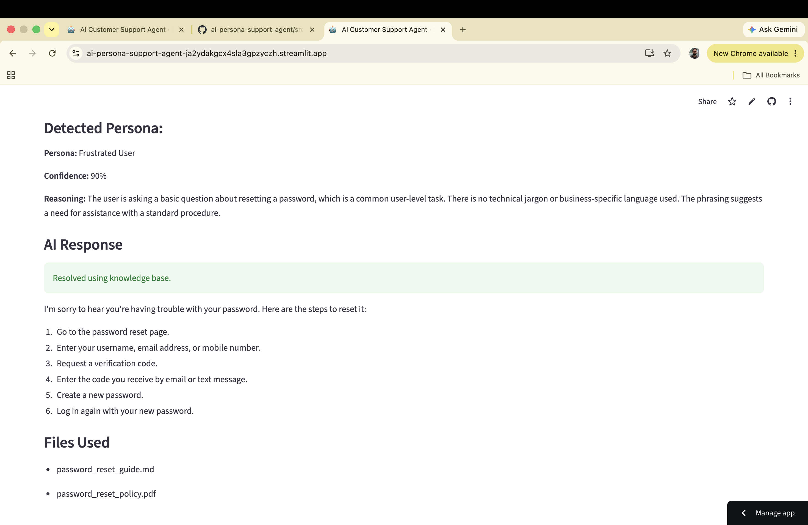
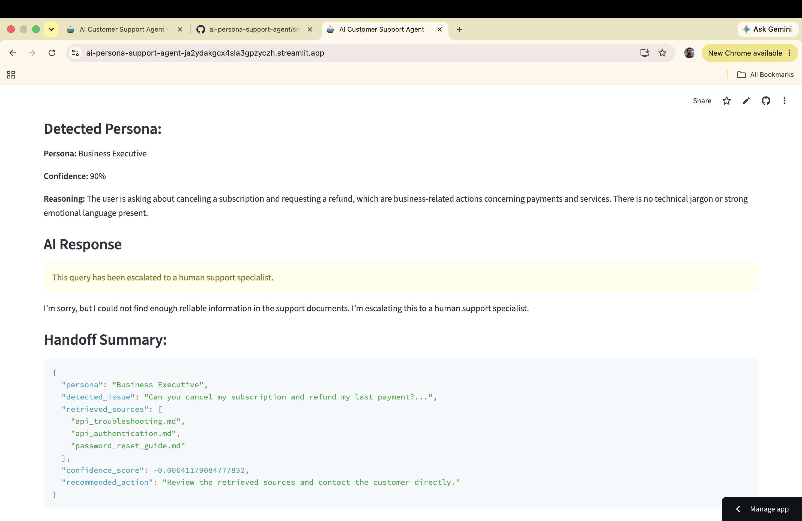
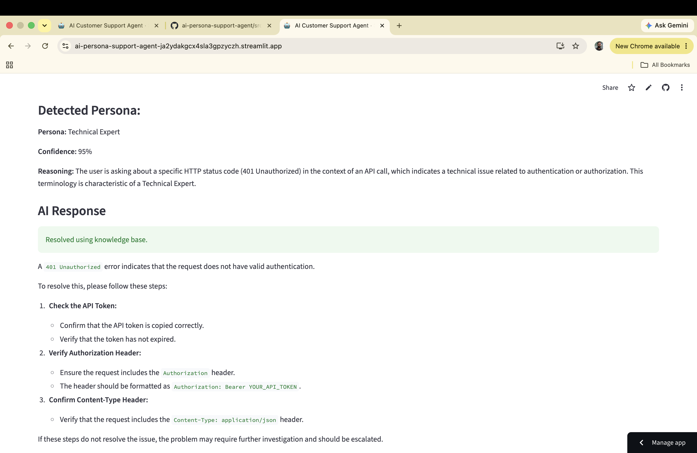

# AI Persona Support Agent

[](https://www.python.org/)
[](https://streamlit.io/)
[](https://ai.google.dev/)
[](https://www.trychroma.com/)
[](#license)

An intelligent **Retrieval-Augmented Generation (RAG)** customer support assistant that adapts its communication style based on user persona.

Built with **Google Gemini**, **ChromaDB**, **LangChain text splitting**, and **Streamlit**, this project retrieves answers from a custom knowledge base before generation, reducing hallucinations and improving response reliability.

## Why This Project? 🚀

- Demonstrates production-relevant **RAG architecture** for support automation
- Implements **persona-aware response generation** for better user experience
- Includes **human escalation logic** for low-confidence retrieval scenarios
- Showcases practical AI engineering: ingestion, embeddings, retrieval, and UI

## Features ✨

- Retrieval-Augmented Generation (RAG)
- Customer persona classification:
	- Technical Expert
	- Frustrated User
	- Business Executive
- Adaptive response generation by persona
- Human escalation for low-confidence retrieval
- Semantic search with embeddings
- Gemini Embedding Model integration
- ChromaDB vector database
- Automatic document loading and vector DB initialization
- Supports `.md`, `.txt`, and `.pdf` knowledge documents
- Automatic chunking with LangChain text splitters
- Streamlit web interface

## Tech Stack 🧰

| Category | Tools |
|---|---|
| Language | Python |
| LLM | Google Gemini API |
| Embeddings | Gemini Embedding Model |
| Vector Store | ChromaDB |
| Framework/UI | Streamlit |
| Document Processing | LangChain, PyPDF |
| Configuration | python-dotenv |

## Architecture 🏗️

The pipeline follows a complete RAG workflow with persona-aware generation:



### RAG Pipeline Summary

1. Knowledge documents are loaded from the local data source.
2. Documents are split into optimized chunks for retrieval quality.
3. Chunks are embedded using Gemini embeddings and stored in ChromaDB.
4. A user query is classified into a persona.
5. Top relevant chunks are retrieved semantically from ChromaDB.
6. Gemini generates a persona-adaptive answer grounded in retrieved context.
7. If retrieval confidence is low, the assistant triggers human escalation.

## Project Structure 📁

```text
customer-support-agent/
|
|-- app.py
|-- requirements.txt
|-- README.md
|-- .env.example
|-- data/
|-- screenshots/
|-- src/
|   |-- config.py
|   |-- rag_pipeline.py
|   |-- vector_store.py
|   |-- classifier.py
|   \-- generator.py
```

<details>
<summary><strong>File Responsibilities</strong></summary>

| File | Responsibility |
|---|---|
| `app.py` | Streamlit entry point; handles user interaction and app flow |
| `requirements.txt` | Python dependencies for local/dev/deployment setup |
| `README.md` | Project documentation |
| `.env.example` | Template for environment variable configuration |
| `data/` | Knowledge base source files (`.md`, `.txt`, `.pdf`) used for retrieval |
| `screenshots/` | UI and result screenshots for documentation |
| `src/config.py` | Centralized configuration (paths, model names, constants) |
| `src/rag_pipeline.py` | End-to-end orchestration of the RAG workflow |
| `src/vector_store.py` | ChromaDB initialization, indexing, and retrieval operations |
| `src/classifier.py` | Persona classification logic for incoming user queries |
| `src/generator.py` | Persona-aware response generation and escalation handling |

</details>

## Installation ⚙️

1. Clone the repository

```bash
git clone https://github.com/<your-username>/ai-persona-support-agent.git
cd ai-persona-support-agent
```

2. Create a virtual environment

```bash
python -m venv .venv
```

3. Activate the environment

```bash
# macOS/Linux
source .venv/bin/activate

# Windows (PowerShell)
.venv\Scripts\Activate.ps1
```

4. Install dependencies

```bash
pip install -r requirements.txt
```

5. Configure environment variables

```bash
cp .env.example .env
```

6. Run the Streamlit app

```bash
streamlit run app.py
```

## Environment Variables 🔐

| Variable | Required | Description |
|---|---|---|
| `GEMINI_API_KEY` | Yes | API key for accessing Google Gemini LLM and embedding services |

## Deployment 🌐

This application is deployed using **Streamlit Community Cloud**.

- Live App: `https://ai-persona-support-agent-ja2ydakgcx4sla3gpzyczh.streamlit.app/`

## Screenshots 🖼️






## Example Queries 💬

| Persona | Sample Query |
|---|---|
| Technical Expert | Why am I getting a 401 Unauthorized error when calling the API? |
| Frustrated User | I forgot my password and I am not receiving the OTP. |
| Business Executive | Our client delivery is delayed because users cannot log in. |

## Future Improvements 🔭

- Better confidence scoring for retrieval quality
- Conversation memory for multi-turn context
- User authentication and role-based access
- Admin dashboard for support insights
- Feedback collection loop for continuous improvement
- Multi-language support
- Larger, domain-specific knowledge base
- Persistent conversation history and analytics

## Author 👤

- GitHub: `https://github.com/avanishtatat`
- LinkedIn: `https://linkedin.com/in/avanishtiwari18`
- Portfolio: `https://avanishtiwari.vercel.app`

## License 📄

MIT License (add a `LICENSE` file to finalize).
